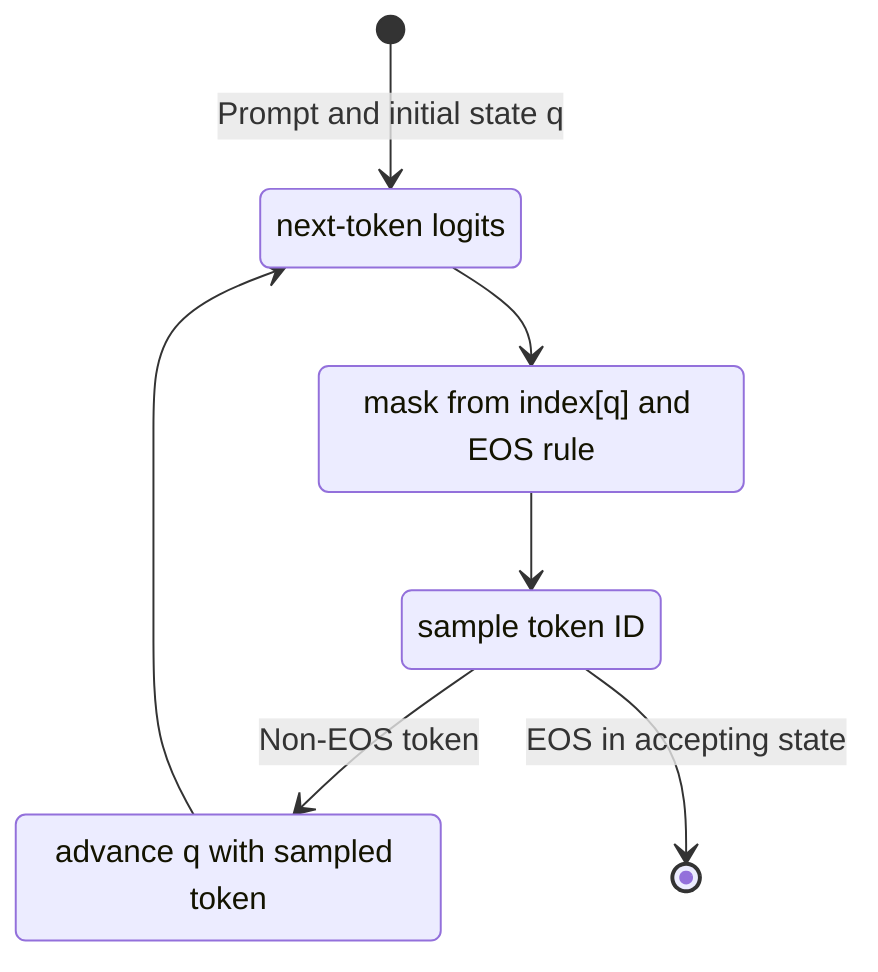

---
aliases:
  - structured decoding
  - guided decoding
  - structured outputs
  - constrained decoding
date: '2024-11-18'
description: structured generations in vLLM a la carte, or in general
id: structured outputs
modified: 2026-10-01 09:15:44 GMT-04:00
tags:
  - ml
  - rfc
  - vllm
title: structured outputs
transclude:
  title: false
---

Structured decoding restricts the next token to continuations allowed by a grammar. The model still chooses the content wherever the grammar leaves a choice. A valid JSON object can contain a wrong answer.

## jump-forward decoding

Also known as fast-forward tokens, forced tokens, or [ff-strings](https://github.com/guidance-ai/llguidance/blob/main/docs/fast_forward.md#safely-converting-ff-strings-to-ff-tokens) (abbrev: ff, jf).

If every valid continuation begins with the same bytes, the engine can append those bytes without sampling them one at a time. The resulting tokens still need a forward pass to populate the KV cache before generation continues. This is where a short prefill can replace several serial decoding steps.

The tempting description is "[[thoughts/Speculative decoding|speculative decoding]] with 100% acceptance." That needs a qualification: a grammar can force a **string** while leaving several tokenizations possible. Choosing one tokenization can change subsequent model probabilities. Grammar validity alone does not give the distribution-preservation guarantee of an exact speculative sampler.

llguidance handles the boundary by withholding trailing tokens when a legal token could extend beyond the forced bytes. See its [fast-forward notes](https://github.com/guidance-ai/llguidance/blob/main/docs/fast_forward.md). Its [token trie](https://github.com/guidance-ai/llguidance/blob/main/docs/toktrie.md) shares work across vocabulary entries with the same byte prefix: once the recognizer rejects a prefix, the traversal skips that subtree.

## async structured outputs

Design references: https://github.com/vllm-project/vllm/pull/26866, https://docs.google.com/document/d/1wmSQk3BYQU3axP4Sb0179IgVNzoMSyE68q0rPZmpdyA

Process names from those design notes:

- `SchedulerProc`
- `WorkerProc`
- `StandaloneProc`, combining scheduler and worker

The dependency to preserve: a mask must reflect the request's accepted tokens before it is used to sample the next token. CPU mask generation can overlap a GPU forward pass when the scheduler has already received the preceding sampled token.

## structural tags

Design reference: [docs](https://docs.google.com/document/d/1o9ZZEFofxb-dJ_cDTi_c3riOJOm4higcSGpvKKNdmtY/edit?tab=t.0#heading=h.nc4nxxczgw4w).

---

## V1 Structured Outputs Compatibility

> [!important]
>
> Historical V1 design notes, including [RFC #11908](https://github.com/vllm-project/vllm/issues/11908), opened January 9, 2025. Structured-output support is present in the [v0.8.0 source](https://github.com/vllm-project/vllm/tree/v0.8.0/vllm/v1/structured_output). The proposals and meeting questions below record the integration work; consult [vLLM's documentation](https://docs.vllm.ai) for the engine version being deployed.

The integration had to account for the V1 tensor-parallel execution model described in [PR #9856](https://github.com/vllm-project/vllm/pull/9856):

- The executor created $N$ worker processes, replacing V0's $N-1$ worker processes.
- All workers ran `prepare_inputs` and the sampler. Each therefore needed the logits, using an all-gather in place of a gather to one worker.
- The executor broadcast scheduler output through shared-memory queues; one worker returned the model-runner output.
- Workers stayed in a model-execution loop with termination as the other control operation.

Design preference at the time: prioritize backend performance, then justify the compatibility cost of each additional backend.

## proposal

![[thoughts/images/constrained-proposal-scheduler.webp|scheduler broadcast bitmask]]

Split responsibilities between the scheduler and workers:

1. **Scheduler**:
   - Track which requests need constrained decoding. A request waiting for grammar compilation should not stall unrelated ready requests in the batch; see the [[posts/structured decoding#tentative plans for v1|motivation]].
   - Keep unready guided requests in a waiting queue until their grammar is compiled. Readiness makes a request eligible for scheduling; it does not by itself give that request higher priority.
   - After receiving a sampled token, advance that request's grammar matcher and produce its next-token bitmask.
   - Overlap mask production with the next model forward pass where dependencies permit. The sketch separates scheduler-output and mask broadcasts; workers need the correct mask before sampling.
   - (P1) Investigate jump-forward support, including advancing or rolling back matcher and KV-cache state after retokenization.
2. **Worker**:
   - Apply the request's bitmask to logits before sampling, setting disallowed entries to $-\infty$.

This moves compilation and matcher state into request scheduling. Cold compilation still contributes to that request's time to first token (TTFT); the benefit is that other requests can proceed.

## alternatives consideration

The working-group notes rejected a worker-local logit-processor abstraction as the sole integration point. The scheduler needed request readiness and grammar state to handle compilation and future jump-forward work.

## background

![[thoughts/images/vllm/pre-optimized-logit-processor-handling.webp|watergraph of current logit processor stack]]

_reference: [vllm-project/vllm#5329](https://github.com/vllm-project/vllm/pull/5329)_

The historical V0 path applied logit processors [row by row](https://github.com/vllm-project/vllm/blob/1ea291a4173a82c537ab42487e23375be4926d30/vllm/model_executor/layers/logits_processor.py#L143). Per-request CPU work on this path could delay sampling for the batch. Grammar compilation, mask generation and applying a mask are separate costs; warming a compilation cache only removes the first of these.

SGLang's [2024 jump-forward design](https://lmsys.org/blog/2024-02-05-compressed-fsm/#method-1-finite-state-machine-based) also skipped serial decoding over forced text. Supporting that requires coordination with token history and the KV cache, beyond changing a row of logits.

> {@cadedaniel}: "tree scoring in [spec decode] could use the same API as multi-path jump decoding."

> [!question] How should we handle FSM per requests?
>
> - Different schemas can require different compiled grammars. Repeated schemas can share a compiled artifact, while each request keeps its own matcher state.
> - Original proposal: accept common schemas at server initialization, much as we configure a system prompt. How much cold-compilation work would that remove for the actual workload?

> [!question] Why should we follow the plugins system?
>
> - If we choose the fastest backend, what additional requirements justify supporting others?
> - Extensibility has an integration cost. Measure that cost separately from each backend's grammar coverage and runtime.

---

## appendix.

Background for the design above. The finite-state sections cover regular constraints; recursively nested grammars need a stack or an equivalent parser.

### batched constrained decoding using pushdown automaton

Implemented in [mlc-ai/xgrammar](https://github.com/mlc-ai/xgrammar). The XGrammar paper [@dong2025xgrammarflexibleefficientstructured] describes a byte-level pushdown automaton (PDA) for context-free grammars. The stack records returns from nested rules. `GrammarMatcher` carries this parsing state; calling it an FSM loses the stack that makes recursion possible.

> [!important] string and token distinction
>
> The model samples token IDs. The grammar checks the bytes represented by those tokens. One token may cross several grammar-rule boundaries or contain only part of a UTF-8 character.

XGrammar caches checks that depend only on the current rule position. Tokens whose validity depends on the enclosing stack need runtime checks. Each request advances its own matcher after accepting a token; batching collects the resulting masks.

#### questions

Questions from the original integration discussion, with unresolved measurements kept explicit:

- How much vocabulary preprocessing can be shared across requests using the same tokenizer?
- How much mask work depends on the full parser stack?
- Can compilation run before the request reaches the execution batch?
- Which CPU-to-GPU synchronization remains on the sampling path?

> [!question] worst-case scenario for grammar compilation?
>
> Measure cold compilation separately from per-token mask generation. The original mask-timing note had no grammar, tokenizer, machine or benchmark attached, so it cannot answer this question.

> [!question] time linearly increase for batch size?
>
> There is one matcher state per request. CPU parallelism can overlap their work; the resulting latency depends on available cores and grammar costs.

> [!question] do we need to parallelize on vLLM?
>
> XGrammar exposes [compiler thread controls](https://github.com/mlc-ai/xgrammar/blob/main/python/xgrammar/compiler.py). That does not settle how the serving engine schedules mask generation across requests.

> [!question] shape of masks?
>
> The [Python matcher API](https://github.com/mlc-ai/xgrammar/blob/main/python/xgrammar/matcher.py) uses an `int32` bitmask with shape $\left(B,\lceil |\mathcal{V}|/32\rceil\right)$ for batch size $B$ and vocabulary $\mathcal{V}$. Each vocabulary entry occupies one bit. The mask and logits must be available on the device used to apply it.

> [!question] supported tokenizers?
>
> Historical November 22 note: GLM was still pending. Treat this as a dated integration observation; check the tokenizer adapter for the intended release.

> [!question] Given that detokenizer is in a separate process with vLLM, then can we stops duplicating this process?
>
> Mask generation needs token bytes to test grammar transitions. Streaming detokenization also manages text output to the client. Shared vocabulary metadata may help, but the two operations have different state and output requirements.

#### future plans

Historical integration checklist:

- Function calling support.
- Grammar coverage, including Python. XGrammar already targets context-free grammars; which language features a particular integration accepts needs its own check.

The paper's low-overhead serving results rely on CPU grammar work overlapping GPU inference. "Zero overhead" is a workload-dependent performance claim; compilation, transfer and mask application still perform work.

### compressed FSM for jump-ahead tokens.

Implemented in [@zheng2024sglangefficientexecutionstructured]. The [2024 SGLang description](https://lmsys.org/blog/2024-02-05-compressed-fsm/) motivates the following three approaches.

#### Method 1: [[thoughts/structured outputs#Guided generations with FSM.|FSM]]-based decoding

An FSM tracks the generated byte prefix. Before sampling, disallowed tokens receive logit $-\infty$, leaving only grammar-valid continuations [@willard2023efficientguidedgenerationlarge].

![[thoughts/images/vllm/constrained-json-fsm.webp|Decoding with FSM]]

A sampled token can traverse several byte transitions. Serial token-by-token model execution comes from the decoding loop, so an FSM need not impose one neural-network call per character or per automaton state.

#### Method 2: Interleaved-based

A generation program alternates known text with constrained model output. Known text can be processed as a prefill chunk. [Guidance](https://github.com/guidance-ai/guidance#guidance-acceleration) provides this style of programming.

The difficult boundary is between the known and generated text: a model token can span both. Interpreter communication and retokenization also contribute to runtime. Expressiveness depends on the language and implementation, so interleaving alone does not imply weaker grammar support.

#### **==Method 3: Jump-Forward Decoding with compressed FSM==**

![[thoughts/images/vllm/jump-forward-decoding-fsm.webp|Jump-forward decoding via compressed FSM]]

Follow a forced byte path until the grammar offers a choice, then process the forced text as a chunk. A path must also account for possible termination: an accepting state can permit EOS even when it has only one outgoing byte transition.

> [!important]+ tokenization boundary handling
>
> Suppose the output format needs `"Hello",` and the vocabulary contains a token for `",`. Constraining the string field in isolation rejects that token because the comma lies outside the field. A grammar for the whole output can accept it.
>
> This can alter completion probabilities. It does not prove that generation must loop forever: a separate closing-quote token or a length limit may still end the step.

SGLang's historical implementation appended forced text and retokenized the combined output, reusing the unchanged prefix's KV cache. The cost depends on the changed suffix and the serving implementation. llguidance's boundary treatment is described [[thoughts/structured outputs#jump-forward decoding|above]]. [^coalescence]

[^coalescence]: [[thoughts/structured outputs#Coalescence|Coalescence]] groups forced text so it can be processed without a sampling step for each token.

### Coalescence

Compress a forced path into a string-labeled edge, stopping where the grammar allows different continuations or termination.

![[thoughts/images/vllm/part-of-json-fsm.webp|initial FSM state]]

![[thoughts/images/vllm/compressed-fsm-json.webp|compressed FSM state]]

A token-transition index stores the result of consuming each allowed token from a given state. The lookup must use the **current** state, and its keys remain token IDs. Decoded strings are useful labels for inspection; distinct token IDs can decode to the same bytes.



> [!note]- example
>
> Suppose the vocabulary contains every nonempty substring of `name`. The following graph contains all eight segmentations of that word. This is a toy vocabulary, not a claim about a particular model's tokenizer.
>
> ```mermaid
> stateDiagram-v2
>     direction LR
>     [*] --> q0
>     q0 --> q1: n
>     q0 --> q2: na
>     q0 --> q3: nam
>     q0 --> q4: name
>     q1 --> q2: a
>     q1 --> q3: am
>     q1 --> q4: ame
>     q2 --> q3: m
>     q2 --> q4: me
>     q3 --> q4: e
>     q4 --> [*]
> ```

There are three interior character boundaries, each either split or joined, giving $2^3=8$ segmentations:

- `["name"]`
- `["n", "a", "m", "e"]`
- `["na", "m", "e"]`
- `["nam", "e"]`
- `["n", "am", "e"]`
- `["n", "ame"]`
- `["na", "me"]`
- `["n", "a", "me"]`

For a tiny JSON language, a string-labeled index can be written as:

```python
simplified_index = {
  0: {'{"': 2},
  2: {'name': 6},
  6: {'":"': 9},
  9: {'Paul': 14, 'John': 14},
  14: {'","': 17},
  17: {'age': 20},
  20: {'":': 22},
  22: {'20': 24, '30': 24},
  24: {'}': 25},
}
```

This accepts four strings: either name paired with either age. There are two branch states, at the name and the age. The edge labels are strings of arbitrary token length, so two branches do not imply two model calls. Forced chunks still need KV-cache computation; compilation, mask production and scheduling also take time. A speedup needs an end-to-end measurement with a specified tokenizer and workload.

> [!important]- difference in sampling distribution
>
> All eight paths spell `name`. Their token sequences can differ in length, positions and embeddings, which changes the model state used for the next prediction. Choosing a segmentation merely because it reaches the same grammar state can change later output probabilities.
>
> ![[thoughts/images/vllm/json-difference-in-sampling-distribution.webp|Variance in sampling distribution for compressed states]]

### Guided generations with FSM.

[@willard2023efficientguidedgenerationlarge], implemented at <https://github.com/dottxt-ai/outlines>.

_assumption: we are building against [[thoughts/Autoregressive models|autoregressive transformers models]]_

Let $\mathcal{V}$ be a finite vocabulary of token IDs, including $\mathrm{EOS}$. A generated sequence belongs to $\mathcal{V}^*$, where the star means finite **ordered sequences**. The permitted completed outputs form a language $\mathcal{F}\subseteq\mathcal{V}^*$ ending in EOS. A powerset would lose order and repetition.

Categorical sampling draws from the model's next-token distribution. Greedy decoding picks its largest entry; beam search keeps several candidate prefixes. Those are different decoding procedures. [^smc]

[^smc]: [@lew2023sequentialmontecarlosteering] formulates controlled generation as posterior inference over sequences and develops sequential [[thoughts/Monte-Carlo|Monte Carlo steering]]. See also [[thoughts/Transformers#Feynman-Kac|Feynman-Kac transformers models]].

Here $\operatorname{LM}$ returns logits. The prompt $x$ remains fixed and $s$ contains only generated token IDs. A Boolean return value distinguishes EOS termination from exhausting the token budget.

```pseudo
\begin{algorithm}
\caption{LLM token sampling}
\begin{algorithmic}
\Function{sample}{$x,L$}
    \State $s \gets ()$
    \For{$i \gets 1, L$}
        \State $p \gets \operatorname{softmax}(\operatorname{LM}(x,s))$
        \State Sample $w \sim \operatorname{Categorical}(p)$
        \If{$w = \mathrm{EOS}$}
            \State \Return $(s,\mathrm{true})$
        \EndIf
        \State $s \gets \operatorname{append}(s,w)$
    \EndFor
    \State \Return $(s,\mathrm{false})$
\EndFunction
\end{algorithmic}
\end{algorithm}
```

For a prefix $s$, the mask $m:\mathcal{V}^*\to\{0,1\}^{|\mathcal{V}|}$ marks tokens that can still lead to an allowed completion. EOS is allowed only when the generated text is already complete. With $p_v(s)$ the original next-token probability,

$$
Z(s)=\sum_{u\in\mathcal{V}}m_u(s)p_u(s),\qquad
\widetilde p_v(s)=\frac{m_v(s)p_v(s)}{Z(s)},\qquad
w\sim\operatorname{Categorical}(\widetilde p(s)).
$$

This requires $Z(s)>0$. For example, probabilities $(1/2,3/10,1/5)$ and mask $(1,0,1)$ give $(5/7,0,2/7)$. Applying a zero-one mask directly to logits would leave a disallowed token with logit zero and positive softmax probability. The equivalent logit operation sets disallowed entries to $-\infty$ before softmax.

Local renormalization preserves the relative probabilities of allowed **next tokens**. It generally changes the model's distribution over whole completed outputs. If first choices `a` and `b` each have probability $1/2$, while valid suffixes have conditional probabilities $1/10$ and $9/10$, local masking keeps the first choice at $(1/2,1/2)$. Conditioning the original model on an entirely valid output would give $(1/10,9/10)$ instead.

> [!math] augmentation upon sampling algorithm
>
> ```pseudo
> \begin{algorithm}
> \caption{token sampling with masking}
> \begin{algorithmic}
> \Function{sample}{$x,L$}
>     \State $s \gets ()$
>     \For{$i \gets 1, L$}
>         \State $p \gets \operatorname{softmax}(\operatorname{LM}(x,s))$
>         \State $a \gets m(s)\odot p$
>         \State $Z \gets \sum_{v\in\mathcal{V}} a_v$
>         \If{$Z=0$}
>             \State \Return $\mathrm{failure}$
>         \EndIf
>         \State Sample $w\sim\operatorname{Categorical}(a/Z)$
>         \If{$w=\mathrm{EOS}$}
>             \State \Return $(s,\mathrm{true})$
>         \EndIf
>         \State $s\gets\operatorname{append}(s,w)$
>     \EndFor
>     \State \Return $(s,\mathrm{false})$
> \EndFunction
> \end{algorithmic}
> \end{algorithm}
> ```

A token budget can expire with a valid prefix that is still incomplete. The caller must inspect the termination status before treating the output as a complete structured value.

> [!important] finite automaton
>
> A DFA is $M=(Q,\Sigma,\delta,q_0,F)$ [^automaton-definition]. For ordinary tokens, let $d:\mathcal{V}\setminus\{\mathrm{EOS}\}\to\Sigma^*$ map token IDs to byte strings. This assumes a tokenizer adapter with context-independent token-byte pieces; special tokens need explicit handling.
>
> > [!note]- example
> >
> > ![[thoughts/images/vllm/fsm-iterative-generations.webp|FSM illustration]]
> >
> > The figure uses `([0-9]*)?\.?[0-9]*{:rs}` and the toy token spellings `A`, `.`, `42`, `.2`, `1`.
> >
> > - Initially, allow `.`, `42`, `.2`, `1` and reject `A`.
> > - After `.2`, a second decimal point is forbidden. Only `42` and `1` remain among these five tokens.
> > - After `1`, allow `.`, `42`, `.2`, `1`. The spelling `.42` is absent from the vocabulary.
> >
> > This regex also accepts empty text and a bare `.`. It illustrates transitions; use `[0-9]+(?:\.[0-9]+)?{:rs}` if the intended format requires an integer part and digits after any decimal point. EOS follows the accepting-state rule separately from these five tokens.

[^automaton-definition]: [[thoughts/DFA|finite state machine]]

    - $Q$ is a finite set of states.
    - $\Sigma$ is a finite alphabet, here bytes.
    - $\delta:Q\times\Sigma\to Q$ is the transition function, including a rejecting sink for invalid transitions.
    - $q_0\in Q$ is the start state.
    - $F\subseteq Q$ is the set of accepting states.

> [!important] determinism
>
> For regular constraints, precompute the token transitions from each DFA state. At runtime, looking up the current state's row avoids rechecking every token's bytes. Producing or applying a vocabulary-sized mask still has a cost.

Let $\delta^*$ consume a whole byte string. Keep only states $R\subseteq Q$ from which an accepting state can be reached. A token is permitted at $q$ when $\delta^*(q,d(v))\in R$. Assume ordinary tokens have nonempty byte strings and the vocabulary can express the remaining valid bytes. Otherwise, compute reachability using token transitions as well.

The following simple construction records every viable byte path. It consumes the first byte explicitly and retains the start state. The intermediate states need not be accepting: a token may end in the middle of a valid output.

```pseudo
\begin{algorithm}
\caption{Find viable paths that consume byte string $v$}
\begin{algorithmic}
\Function{FindSubSequences}{$M,v,R$}
    \State $\mathrm{res}\gets ()$
    \For{$q\in R$}
        \State $r\gets q$, $p\gets(q)$
        \For{$i\gets 0,|v|-1$}
            \State $r\gets\delta(r,v_i)$
            \If{$r\notin R$}
                \State $p\gets()$
                \State \textbf{break}
            \EndIf
            \State $p\gets\operatorname{append}(p,r)$
        \EndFor
        \If{$p\ne()$}
            \State $\mathrm{res}\gets\operatorname{append}(\mathrm{res},p)$
        \EndIf
    \EndFor
    \State \Return $\mathrm{res}$
\EndFunction
\end{algorithmic}
\end{algorithm}
```

Build both the allowed-token set $\sigma(q)$ and the next-state map $\tau(q,v)$. The transition map advances the grammar without rescanning the generated prefix. EOS is added only at accepting states and terminates generation instead of taking a byte transition.

```pseudo
\begin{algorithm}
\caption{Index tokens by DFA start and end states}
\begin{algorithmic}
\Function{MapStatesToVocab}{$M,\mathcal{V},d,R$}
    \State Initialize $\sigma(q)\gets\emptyset$ for each $q\in Q$
    \State Initialize an empty map $\tau$
    \For{$v\in\mathcal{V}\setminus\{\mathrm{EOS}\}$}
        \State $P\gets\operatorname{FindSubSequences}(M,d(v),R)$
        \For{$p\in P$}
            \State $\sigma(p_0)\gets\sigma(p_0)\cup\{v\}$
            \State $\tau(p_0,v)\gets p_{|p|-1}$
        \EndFor
    \EndFor
    \For{$q\in F$}
        \State $\sigma(q)\gets\sigma(q)\cup\{\mathrm{EOS}\}$
    \EndFor
    \State \Return $(\sigma,\tau)$
\EndFunction
\end{algorithmic}
\end{algorithm}
```

This index has a row for each finite state. A general PDA also depends on its stack, so the same finite table cannot enumerate all recursive parser configurations. That is the caching problem addressed by [[thoughts/structured outputs#batched constrained decoding using pushdown automaton|XGrammar]] above.
