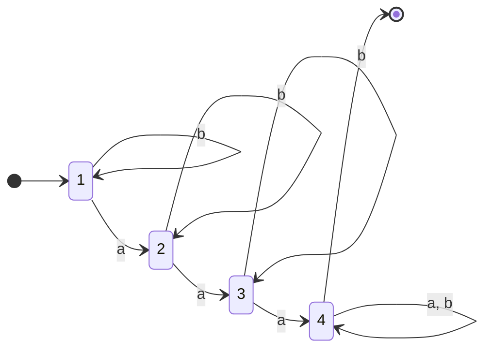
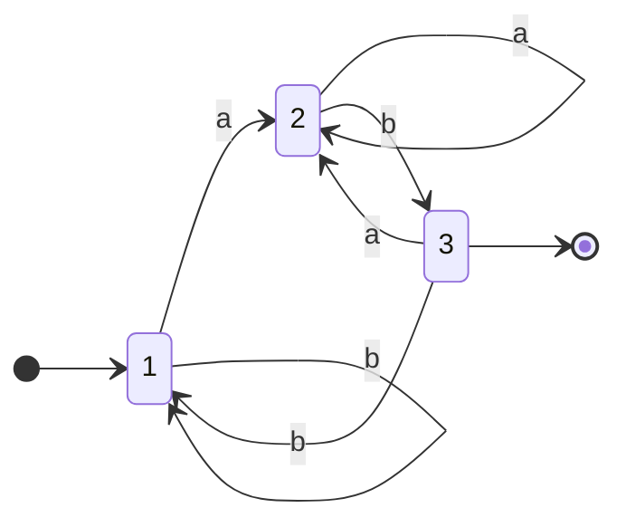
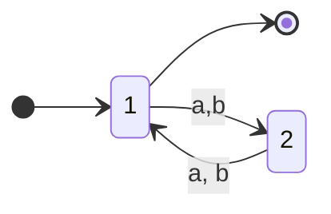
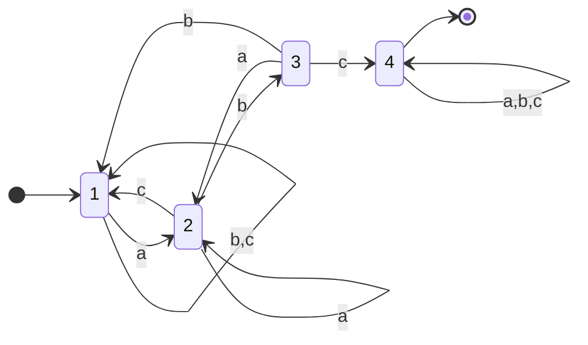
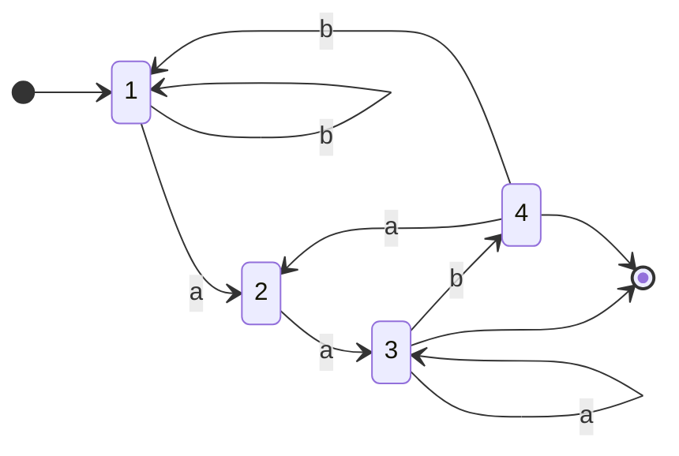

## definition
$$
\Sigma^{*}: \text{set of all strings based off }\Sigma
$$

$$
\begin{align*}
\text{DFA}\quad M &= (Q, \Sigma, \delta, s, F)  \\\
Q &: \text{finite set of states} \\\
\Sigma &: \text{finite alphabet} \\\
\delta &: Q \times \Sigma \rightarrow Q \rightarrow \delta: Q \times \Sigma \rightarrow Q \\\
s &: \text{start state},\quad s\in{Q} \\\
F &: \text{set of final states},\quad F\subseteq{Q} \\\
\end{align*}
$$
### examples
Ex: $\Sigma = \{a, b\}$. Creates a DFA $M$ that accepts all strings that contains at least three a's.

$$
\begin{align*}
Q &= \{s_1, s_2, s_3, s_4\} \\\
s &= 1 \\\
F &= \{s_4\} \\\
\end{align*}
$$

Transition function:

$$
\begin{align*}
\delta(1, a) = s_2 \\\
\delta(1, b) = s_1 \\\
\delta(2, a) = s_3 \\\
\delta(2, b) = s_2 \\\
\delta(3, a) = s_4 \\\
\delta(3, b) = s_3 \\\
\delta(4, a) = \delta(4, b) = s_4 \\\
\end{align*}
$$

[[thoughts/representations|representation]]:

> if in final string then accept, otherwise reject the string

## language.

[[thoughts/Language|Language]] of machine $\mathcal{L}(M)$ is the set of strings M accepts, such that $\mathcal{L}(M) \in \Sigma^{*}$
$$
\mathcal{L}(M) = \{w \in \Sigma^{*} | \delta(s, w) \in F\}
$$

> [!important]
> Assumption: $\Sigma = \{a, b\}$

### examples

Find DFA $M$ such that $\mathcal{L}(M)=$
1. $\{ xab \mid x \in \Sigma^{*} \}$
2. $\{ x \mid |x| \% 2 = 0 \}$
3. $\{ x \mid x = 2^n\space ,\space n \in \mathbb{N} \}$, $\Sigma = \{0, 1\}$
4. $\{ x \mid "abc" \in x \}$, $\Sigma = \{a, b, c\}$
5. $\{ x \mid \text{a is the second last char of x} \}$
6. $\{ a^n \cdot b^n \mid n \ge 0 \}$
7. $\{ x \mid \text{a is the fifth last char of x} \}$

Ans:

1.

2.

4.

5.

