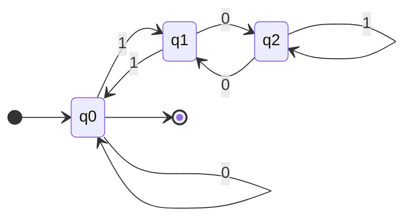

Q1: T/F, if F explain why.
Q4: regular expression, 5 separate q
Q2/Q3: DFAs and NFAs
- Product construction: $\cap$ $\cup$ of DFAs
- Subset construction: NFA to DFA
- Quotient construction: State minimization

### Set theory

Complement in $\Sigma^{*}$:
$$
\overline{L} = \Sigma^{*} - L
$$

associative:
$$
\begin{align*}
(A \cup B) \cup C &= A \cup (B \cup C), \\
(A \cap B) \cap C &= A \cap (B \cap C), \\
(AB)C &= A(BC).
\end{align*}
$$

commutative:
$$
\begin{align*}
A \cup B &= B \cup A \\
A \cap B &= B \cap A
\end{align*}
$$

> [!important] null set
> null set $\emptyset$ is the identity for $\cup$ and annihilator for set concatenation
>
> $A \cup \emptyset = A$ and $A \emptyset = \emptyset A = \emptyset$

set $\{\epsilon\}$ is an identity for set concatenation   $\{\epsilon\}A = A\{\epsilon\} = A$

Set union and intersection are distributive over set concatenation

$$
\begin{align*}
A \cup (B \cap C) &= (A \cup B) \cap (A \cup C) \\\
A \cap (B \cup C) &= (A \cap B) \cup (A \cap C)
\end{align*}
$$

Set concatenation distributes over union

$$
\begin{align*}
A(B \cup C) &= AB \cup AC \\\
(A \cup B)C &= AC \cup BC
\end{align*}
$$

## DFA

![[thoughts/university/sfwr-2fa3/DFA#definition|DFA]]

> Let $\delta : Q \times \Sigma \rightarrow Q$, thus $\hat{\delta} : Q \times \Sigma^{*} \rightarrow Q$

$\delta(q, c) \rightarrow p$ therefore $\hat{\delta}(q, w) \rightarrow p$

### regularity

> [!important]
>
> $$
> \begin{align*}
> \hat{\delta}(q, \epsilon) &= q \\\
> \hat{\delta}(q, xa) &= \delta(\hat{\delta}(q, x), a)
> \end{align*}
> $$

> [!important]
> a subset $A \subset \Sigma^{*}$ is regular if and only if there exists a DFA $M$ such that $\mathcal{L}(M) = L$

> [!important]
>
> All finite languages are regular, ==but not all regular languages are finite==

#### examples

Show $L$ is regular where $L = \{ x \mid x \% 3 = 0 \cup x = \epsilon \}$, with $\Sigma = \{0, 1\}$

Three states, $q_{0}, q_{1}, q_{2}$, where $q_{0}$ denotes the string mod 3 is 0, $q_{1}$ denotes the string mod 3 is 1, and $q_{2}$ denotes the string mod 3 is 2.

$\forall x \in \{0, 1\} \rightarrow \delta(q_{0}, x) = 0 \iff \#x \equiv 0 \space mod \space 3$, $\delta(q_{0}, x) = q_{1} \iff \#x \equiv 1 \space mod \space 3$, $\delta(q_{0}, x) = q_{2} \iff \#x \equiv 2 \space mod \space 3$

---

Assume that A, B are regular, there are automata

$$
M_1 = (Q_1, \Sigma, \delta_1, s_1, F_1) \quad M_2 = (Q_2, \Sigma, \delta_2, s_2, F_2)
$$

Thus
$$
M_{3} = (Q_{3}, \Sigma, \delta_3, s_{3}, F_{3})
$$

where $Q_{3}=Q_{1} \times Q_{2}$, $s_{3} = (s_{1}, s_{2})$, $F_{3} = F_{1} \times F_{2}$, and $\delta_{3}((p, q), x) = (\delta_{1}(p, x), \delta_{2}(q, x))$

with $L(M_{1}) = A$ and $L(M_{2}) = B$, then **$A \cap B$** is regular.

> [!important] Lemma 4.1
> $$
> \delta_3((p, q), x) = (\delta_1(p, x), \delta_2(q, x)) \space \forall x \in \Sigma^*
> $$

Complement set:  $Q - F \in Q$

Trivial machine $\mathcal{L}(M_{1}) = \{\}$, $\mathcal{L}(M_{2}) = \Sigma^*$, $\mathcal{L}(M_{3})=\{ \epsilon \}$

> [!note] De Morgan laws
> $$
> A \cup B = \overline{\overline{A} \cap \overline{B}}
> $$

> [!important] Theorem 4.2
> $$
> L(M_3) = L(M_1) \cap L(M_2)
> $$

> $\overline{L}$ is regular

> $L_{1} \cap L_{2}$ is regular

> $L_{1} \cup L_{2}$ is regular

---
## NFA

![[thoughts/university/sfwr-2fa3/NFA#definition|NFA]]

### subset construction

## product construction

## regex
