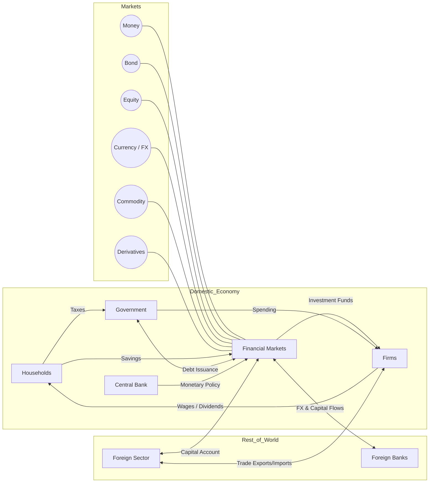

see also: Chapter 1&2 from books

## introduction

> [!abstract] definition
>
> price system _governs_ the operations of markets.

> The process of sell/buy securities is called **securitisation**

> [!question] Importance of Financial Markets?
>
> - venture captial
> - accumulation of physical capitals
> - communicate and transact
> - quick measure of nation's economic health

## functions

- borrowing/lending
- price discovery
- information aggregation and coordination
- risk sharing
- liquidity
- efficiency

### securitisation

> borrowing takes place through primary markets.

where as secondary markets trade securities:

- Exchanges (Auction market)
- OTC Over-the-counter (Dealer market)

> [!IMPORTANT]
>
> trading floor must be **fair, efficient, and liquid**

| aspect       | meaning              | securitisation impact | caveats                                                        |
| ------------ | -------------------- | --------------------- | -------------------------------------------------------------- |
| Transparency | ensure fair prices   | fairness              | Opaque SPVs/OTC deals reduce visibility                        |
| Narrow Width | tight BID/ASK spread | efficiency            | Info asymmetry and conflicted incentives (origination/ratings) |
| Depth        | size of BID/ASK      | liquidity             | Structuring costs, model error, agency frictions               |

### modern financial markets

institutional investors (teachers, personal individuals)

can roughly classified into:

- Brokers
- Dealers
- Investment Bankers
- Financial Intermediaries (Bank)

> traders always aim for less inventory within the firm.

#### sell side

- sell securities and services to investors
  - also known as _prime brokers_
- brokering/dealing/investment research
- research analysts, traders to **execute trade on BUY side**

#### buy side

- private equity funds, mutual funds, unit trust, hedge funds, pension funds
- speculative positions/make relative value trades

#### characters

- Visible and Volatile
- Technological
- Cyberspace

> Dark Pools of Liquidity
>
> Block trades from institutional for anonymity

### liquidity, depth, width

> [!NOTE] liquidity
>
> the ability to sell/buy securities quickly
>
> function of _depth_ and _width_

> [!NOTE] depth
>
> number of shares available (bid/ask size)

> [!NOTE] width
>
> spread between bid/ask prices

## fundamental analysis

concerns about _intrinsic value/fair value_

- benefits to be derived from the security
- estimate how well/how poorly the industry and the company being evaluated will perform in this future
- analysts estimates the intrinsic value the investors will be willing to pay for a share

### top-down

- global economics (international/national economic indicators: GDP, inflation, interest rates, exchange rates) -> regional/industry analysis of total sales, price levels, effect of competing products, foreign competition, industry entry/exits
- narrow to best business/firms in any given industries

### bottom-up

- specific businesses, regardless of region -> investment candidates -> list of invest-able companies -> quality/attractiveness of priced companyt -> investment selection

### characteristics of companies of interest

- with market leadership/competitive advantages
- high and consistent profitability
- capable management
- financial health/strength
- growth opportunity

### factors

- external events
- fiscal policies
- monetary changes
- **inflation**
- business cycle

### business cycle

Peak -> recession -> growth/trough -> Expansion

## technical analysis

> study of market's current behaviour and [[thoughts/quantitative finance|trading]] patterns

The justification is that ==all [[thoughts/Information Theory|information]] concerning a particular security is reflected in the price history and trading pattern of the security==

### theory

- Odd Lot
- Dow Theory
  - Whatever DOW is doing, is considered "good"
- Price Rate of Change
  - momentum
- Advance-Decline Theory
- Volume, Advance-Decline/Volume Theory
- [[thoughts/Bollinger Bands]]

## tasks

- [ ] establish trading group
- [ ] industry/securities to trade
  - [ ] research profile and history
- [ ] FTS
