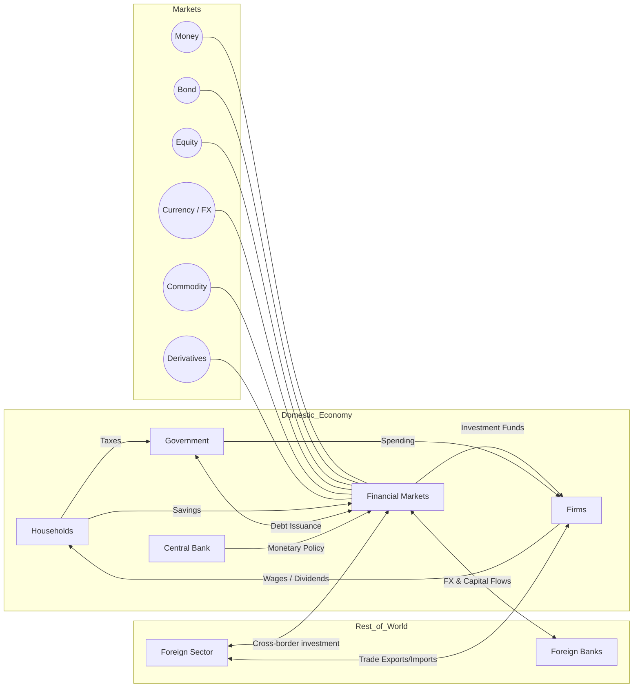

See Chapters 1 and 2 of the course text.

## introduction

Financial markets connect people who supply funds with people who seek them. Prices record the terms at which participants are willing to trade. Those prices reflect expectations about future payments and risk, so they are an incomplete measure of a country's current economic health.

Buying and selling securities is trading. Securitisation means issuing securities backed by assets or their cash flows, e.g., a pool of mortgage loans. The [IMF's account](https://www.imf.org/en/news/articles/2015/09/28/04/53/sopol012915a) describes how those claims are packaged.

```mermaid
flowchart LR
  subgraph Domestic_Economy
    H[Households]
    F[Firms]
    G[Government]
    FM[Financial Markets]
    CB[Central Bank]
  end

  subgraph Rest_of_World
    ROW[Foreign Sector]
    FB[Foreign Banks]
  end

  subgraph Markets
    Mny((Money))
    Bnd((Bond))
    Eq((Equity))
    FX((Currency / FX))
    Cmd((Commodity))
    Der((Derivatives))
  end

  Mny --- FM
  Bnd --- FM
  Eq  --- FM
  FX  --- FM
  Cmd --- FM
  Der --- FM

  H -->|Savings| FM
  FM -->|Investment Funds| F
  F -->|Wages / Dividends| H
  H -->|Taxes| G
  G -->|Spending| F
  G <-->|Debt Issuance| FM
  CB -->|Monetary Policy| FM

  FM <-->|FX & Capital Flows| FB
  ROW <-->|Trade Exports/Imports| F
  ROW <-->|Cross-border investment| FM
```

## functions

Markets allow issuers to raise funds and investors to transfer claims. Trading also reveals prices and lets participants transfer risk to someone willing to hold it. An active secondary market can make a newly issued security easier to sell later.

### primary and secondary markets

In a [primary market](https://www.investor.gov/introduction-investing/investing-basics/glossary/primary-market), an issuer sells new securities and receives the proceeds. Issuing debt creates a borrowing obligation. Issuing equity sells an ownership claim.

In a [secondary market](https://www.investor.gov/introduction-investing/investing-basics/glossary/secondary-market), investors trade securities that already exist. The seller receives the proceeds of that trade. Exchanges and over-the-counter venues provide different arrangements for matching buyers and sellers.

### securitisation

A securitisation creates claims backed by specified assets or cash flows. Those securities can be issued in a primary market and later traded in a secondary market. Securitisation describes the creation of the claims; primary and secondary describe the transactions in them.

### modern financial markets

Pension funds and mutual funds are institutional investors. Individuals investing their own money are retail investors. A broker executes transactions for customers. A dealer buys and sells for its own account as a business. An investment bank can help an issuer arrange and sell a new offering. The [SEC's broker-dealer guide](https://www.sec.gov/about/divisions-offices/division-trading-markets/division-trading-markets-compliance-guides/guide-broker-dealer-registration) distinguishes these activities.

Dealers manage inventory against target positions and risk limits. They can adjust quotes as their inventory changes. See the [BIS account of market-making](https://www.bis.org/publications/shifting-tides-market-liquidity-and-market-making-fixed-income-instruments).

#### sell side

Sell-side firms provide services to issuers and investors, including brokerage and research. Prime brokerage is a specific business serving institutional clients. Those services can include custody and securities lending. Prime brokerage is one part of the sell side. [FINRA's institutional-business material](https://www.finra.org/sites/default/files/2018_AC_Common_Exam_Findings_Institutional.pdf) describes that scope.

#### buy side

Buy-side institutions manage investment portfolios. Their objectives depend on the mandate, e.g., a pension fund invests to help meet future benefit payments. A buy-side firm can use a sell-side broker to execute a trade without transferring the portfolio decision to that broker.

#### dark pools

Dark pools are trading venues where resting orders are not displayed publicly before execution. An institution may use one to limit the information revealed by a large order. In US equities, completed trades still have to be reported. [FINRA's explanation](https://www.finra.org/investors/insights/can-you-swim-dark-pool) distinguishes pre-trade visibility from post-trade reporting.

### liquidity, depth, width

Liquidity is the ability to trade promptly at low cost and with limited price impact. The [BIS definitions](https://www.bis.org/publ/cgfs_note01.htm) distinguish several dimensions of market liquidity.

| term         | meaning                                                                                                 |
| ------------ | ------------------------------------------------------------------------------------------------------- |
| width        | The difference between the best ask and best bid is the quoted spread.                                  |
| depth        | The quantity available at relevant prices determines how much can trade before worse prices are needed. |
| transparency | Participants can observe information about orders or completed trades, depending on the venue's rules.  |

A narrow quoted spread says little about the cost of a large order if only a small quantity is available at those quotes.

## fundamental analysis

Fundamental analysis estimates a security's value from expected benefits and their risk. For equity, an analyst studies the firm's ability to earn and distribute cash over time. The resulting valuation depends on assumptions about future performance and the return investors require.

### top-down

A top-down analysis starts with the economy and industry, then examines individual firms. Interest rates can affect both borrowing costs and the rate used to discount future payments.

### bottom-up

A bottom-up analysis starts with a firm and its price. The analyst then checks whether its business prospects justify that price. A profitable company can still be an unattractive investment if the price requires implausible growth.

### business cycle

An expansion ends at a peak. A contraction continues to a trough, after which expansion resumes. These are the [NBER's turning-point definitions](https://www.nber.org/research/business-cycle-dating/business-cycle-dating-procedure-frequently-asked-questions). A trough marks the low point in activity.

## technical analysis

Technical analysts study price and trading-volume patterns. Using those observations to forecast a return requires a rule and evidence about its performance. The claim that past market information is already reflected in prices belongs to the weak form of the [[thoughts/efficient market hypothesis]]. It does not establish that a chart pattern earns excess returns.

### theory

- Dow Theory uses trends and confirmation between industrial and transportation averages. The [CMT Association's historical account](https://cmtassociation.org/technically_speaking/technically-speaking-october-2011/) describes that approach.
- Price rate of change measures how far a price has moved over a chosen interval.
- Advance-decline indicators count rising and falling securities to describe market breadth. Volume-based versions use trading volume to weight advancing and declining securities.
- Odd-lot indicators examine trades smaller than the market's standard round lot.
- [[thoughts/Bollinger Bands]] locate a price relative to its recent average and dispersion.

## tasks

- [ ] establish trading group
- [ ] industry/securities to trade
  - [ ] research profile and history
- [ ] FTS
