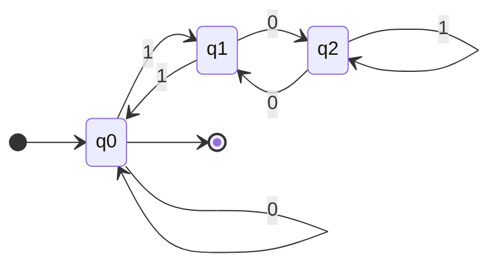

Book: [[thoughts/university/twenty-four-twenty-five/sfwr-2fa3/Automata and Computability.pdf|pdf]]

Q1: T/F, if F explain why.
Q4: regular expression, 5 separate q
Q2/Q3: DFAs and NFAs

- Product construction: $\cap$ $\cup$ of DFAs
- Subset construction: NFA to DFA
- Quotient construction: State minimization

### Set theory

Complement in $\Sigma^{*}$:

$$
\overline{L} = \Sigma^{*} - L
$$

associative:

$$
\begin{align*}
(A \cup B) \cup C &= A \cup (B \cup C), \\
(A \cap B) \cap C &= A \cap (B \cap C), \\
(AB)C &= A(BC).
\end{align*}
$$

commutative:

$$
\begin{align*}
A \cup B &= B \cup A \\
A \cap B &= B \cap A
\end{align*}
$$

> [!important] null set
> null set $\emptyset$ is the identity for $\cup$ and annihilator for set concatenation
>
> $A \cup \emptyset = A$ and $A \emptyset = \emptyset A = \emptyset$

set $\{\epsilon\}$ is an identity for set concatenation $\{\epsilon\}A = A\{\epsilon\} = A$

Set union and intersection are distributive over set concatenation

$$
\begin{align*}
A \cup (B \cap C) &= (A \cup B) \cap (A \cup C) \\\
A \cap (B \cup C) &= (A \cap B) \cup (A \cap C)
\end{align*}
$$

Set concatenation distributes over union

$$
\begin{align*}
A(B \cup C) &= AB \cup AC \\\
(A \cup B)C &= AC \cup BC
\end{align*}
$$

## DFA

![[thoughts/DFA#definition|DFA]]

> Let $\delta : Q \times \Sigma \rightarrow Q$, thus $\hat{\delta} : Q \times \Sigma^{*} \rightarrow Q$

$\delta(q, c) \rightarrow p$ therefore $\hat{\delta}(q, w) \rightarrow p$

### regularity

> [!important]
>
> $$
> \begin{align*}
> \hat{\delta}(q, \epsilon) &= q \\\
> \hat{\delta}(q, xa) &= \delta(\hat{\delta}(q, x), a)
> \end{align*}
> $$

> [!important]
> a subset $A \subset \Sigma^{*}$ is regular if and only if there exists a DFA $M$ such that $\mathcal{L}(M) = L$

> [!important]
>
> All finite languages are regular, ==but not all regular languages are finite==

#### examples

Show $L$ is regular where $L = \{ x \mid x \% 3 = 0 \cup x = \epsilon \}$, with $\Sigma = \{0, 1\}$

Three states, $q_{0}, q_{1}, q_{2}$, where $q_{0}$ denotes the string mod 3 is 0, $q_{1}$ denotes the string mod 3 is 1, and $q_{2}$ denotes the string mod 3 is 2.

$\forall x \in \{0, 1\} \rightarrow \delta(q_{0}, x) = 0 \iff \#x \equiv 0 \space mod \space 3$, $\delta(q_{0}, x) = q_{1} \iff \#x \equiv 1 \space mod \space 3$, $\delta(q_{0}, x) = q_{2} \iff \#x \equiv 2 \space mod \space 3$

---

## product construction

Assume that A, B are regular, there are automata

$$
M_1 = (Q_1, \Sigma, \delta_1, s_1, F_1) \quad M_2 = (Q_2, \Sigma, \delta_2, s_2, F_2)
$$

Thus

$$
M_{3} = (Q_{3}, \Sigma, \delta_3, s_{3}, F_{3})
$$

where $Q_{3}=Q_{1} \times Q_{2}$, $s_{3} = (s_{1}, s_{2})$, $F_{3} = F_{1} \times F_{2}$, and $\delta_{3}((p, q), x) = (\delta_{1}(p, x), \delta_{2}(q, x))$

with $L(M_{1}) = A$ and $L(M_{2}) = B$, then **$A \cap B$** is regular.

> [!important] Lemma 4.1
>
> $$
> \delta_3((p, q), x) = (\delta_1(p, x), \delta_2(q, x)) \space \forall x \in \Sigma^*
> $$

Complement set: $Q - F \in Q$

Trivial machine $\mathcal{L}(M_{1}) = \{\}$, $\mathcal{L}(M_{2}) = \Sigma^*$, $\mathcal{L}(M_{3})=\{ \epsilon \}$

> [!note] De Morgan laws
>
> $$
> A \cup B = \overline{\overline{A} \cap \overline{B}}
> $$

> [!important] Theorem 4.2
>
> $$
> L(M_3) = L(M_1) \cap L(M_2)
> $$

> $\overline{L}$ is regular

> $L_{1} \cap L_{2}$ is regular

> $L_{1} \cup L_{2}$ is regular

---

## NFA

![[thoughts/NFA#definition|NFA]]

> [!important] transition function
>
> $\hat{\Delta}: P(Q) \times \Sigma^* \rightarrow P(Q)$

$$
\begin{align*}
\hat{\Delta}(A, a) &= \bigcup_{p \in \hat{\Delta}(A, \varepsilon)} \Delta(p, a) \\\
& \\\
&= \bigcup_{p \in A} \Delta(p, a).
\end{align*}
$$

## subset construction

> [!important] acceptance
>
> $N$ accepts $x \in \Sigma^*$ if
>
> $$
> \hat{\Delta}(s, x) \cap F \neq \emptyset
> $$

Define $L(N) = \{ x \in \Sigma^* \mid N\text{ accepts } x\}$

> [!important] Theorem 4.3
>
> Every DFA $(Q, \Sigma, \delta, s, F)$ is equvalent to an NFA $(Q, \Sigma, \Delta, \{s\}  , F)$ where $\Delta(p, a) = \{ \delta(p, a) \}$

> [!important] Lemma 6.1
>
> For any $x, y \in \Sigma^* \land A \subseteq Q$,
>
> $$
> \hat{\Delta}(s, xy) = \hat{\Delta}(\hat{\Delta}(s, x), y)
> $$

> [!important] Lemma 6.2
>
> $\hat{\Delta}$ commutes with set union:
>
> $$
> \hat{\Delta}(\bigcup_i A_i, x) =\bigcup_i \hat{\Delta}(A_i, x)
> $$

Let $N = (Q_N, \Sigma, \Delta_N, S_N, F_N)$ be arbitrary NFA. Let M be DFA $M = (Q_M, \Sigma, \delta_M, s_M, F_M)$ where:

$$
\begin{align*}
Q_M &= P(Q_N) \\\
\delta_M(A, a) &= \hat{\Delta}_N(A, a) \\\
s_M &= S_N \\\
F_M &= \{ A \in Q_N \mid A \cap F_N \neq \emptyset \}
\end{align*}
$$

> [!important] Lemma 6.3
>
> For any $A \subseteq Q_N \land x \in \Sigma^*$
>
> $$
> \hat{\delta}_M(A, x) = \hat{\Delta}_N(A, x)
> $$

> [!important] Theorem 6.4
> The automata M and N accept the same sets.

## regex

_atomic patterns_ are:

- $L(a) = \{a\}$
- $L(\epsilon) = \{\epsilon\}$
- $L(\emptyset) = \emptyset$
- $L(\#) = \Sigma$: matched by any symbols
- $L(@) = \Sigma^*$: matched by any string

_compound patterns_ are formed by combining ==binary operators== and ==unary operators==.

> [!tip] redundancy
> $a^+ \equiv aa^*$, $\alpha \cap \beta = \overline{\overline{\alpha} + \overline{\beta}}$

> if $\alpha$ and $\beta$ are patterns, then so are $\alpha + \beta, \alpha \cap \beta, \alpha^*, \alpha^+, \overline{\alpha}, \alpha \beta$

> [!important] The following holds for x matches:
>
> $L(\alpha + \beta) = L(\alpha) \cup L(\beta)$
>
> $L(\alpha \cap \beta) = L(\alpha) \cap L(\beta)$
>
> $L(\alpha\beta) = L(\alpha)L(\beta) = \{yz \mid y \in L(\alpha) \land z \in L(\beta)\}$
>
> $L(\alpha^*) = L(\alpha)^0 \cup L(\alpha)^1 \cup \dots = L(\alpha)^*$
>
> $L(\alpha^+) = L(\alpha)^+$

> [!important] Theorem 7.1
>
> $\Sigma^* = L(\#^*) = L(@)$
>
> Singleton set $\{x\} = L(x)$
>
> Finite set: $\{x_{1},x_{2},\dots,x_m\} = L(x_{1}+x_{2}+\dots+x_m)$

> [!important] Theorem 9
>
> $$
> \begin{array}{cccl}
> \alpha + (\beta + \gamma) & \equiv & (\alpha + \beta) + \gamma & (9.1) \\
> \alpha + \beta & \equiv & \beta + \alpha & (9.2) \\
> \alpha + \phi & \equiv & \alpha & (9.3) \\
> \alpha + \alpha & \equiv & \alpha & (9.4) \\
> \alpha(\beta\gamma) & \equiv & (\alpha\beta)\gamma & (9.5) \\
> \epsilon \alpha & \equiv & \alpha\epsilon \equiv \alpha & (9.6) \\
> \alpha(\beta + \gamma) & \equiv & \alpha\beta + \alpha\gamma & (9.7) \\
> (\alpha + \beta)\gamma & \equiv & \alpha\gamma + \beta\gamma & (9.8) \\
> \phi\alpha & \equiv & \alpha\phi \equiv \phi & (9.9) \\
> \epsilon + \alpha^* & \equiv & \alpha^* & (9.10) \\
> \epsilon + \alpha^* & \equiv & \alpha^* & (9.11) \\
> \beta + \alpha\gamma \leq \gamma & \Rightarrow & \alpha^*\beta \leq \gamma & (9.12) \\
> \beta + \gamma\alpha \leq \gamma & \Rightarrow & \beta\alpha^* \leq \gamma & (9.13) \\
> (\alpha\beta)^* & \equiv & \alpha(\beta\alpha)^* & (9.14) \\
> (\alpha^* \beta)^* \alpha^* & \equiv & (\alpha + \beta)^* & (9.15) \\
> \alpha^* (\beta\alpha^*)^* & \equiv & (\alpha + \beta)^* & (9.16) \\
> (\epsilon + \alpha)^* & \equiv & \alpha^* & (9.17) \\
> \alpha\alpha^* & \equiv & \alpha^* \alpha & (9.18) \\
> \end{array}
> $$

## quotient automata

also known as DFA state minimization

> [!important] definition
>
> $$
> p \approx q \equiv [p] = [q]
> $$

Define

$$
M / \approx \space = (Q', \Sigma, \delta', [s], F')
$$

where (13.1)

$$
\begin{align*}
Q' &= Q / \approx \\\
\delta'([p], a) &= [\delta(p, a)] \\\
s' &= [s] \\\
F' &= \{ [p] \mid p \in F \}
\end{align*}
$$

> [!important] Lemma 13.5
>
> If $p \approx q$, then $\delta(p, a) \approx \delta(q, a)$
> equivalently, if $[p] = [q]$, then $[\delta(p, a)] = [\delta(q, a)]$

> [!important] Lemma 13.6
>
> $p \in F \iff [p] \in F'$

> [!important] Lemma 13.7
>
> $$
> \forall x \in \Sigma^*, \hat{\delta'}([p], x) = [\hat{\delta}(p, x)]
> $$

> [!important] Theorem 13.8
>
> $L(M / \approx) = L(M)$

> [!important] algorithm
>
> 1. Table of all pairs $\{p, q\}$
> 2. Mark all pairs $\{p, q\}$ if $p \in F \land q \notin F \lor q \in F \land p \notin F$
> 3. If there exists unmarked pair $\{p, q\}$, such that $\{ \delta(p, a), \delta(q, a) \}$ is marked, then mark $\{p, q\}$
> 4. $p \approx q \iff \{p, q\}$ is not marked
