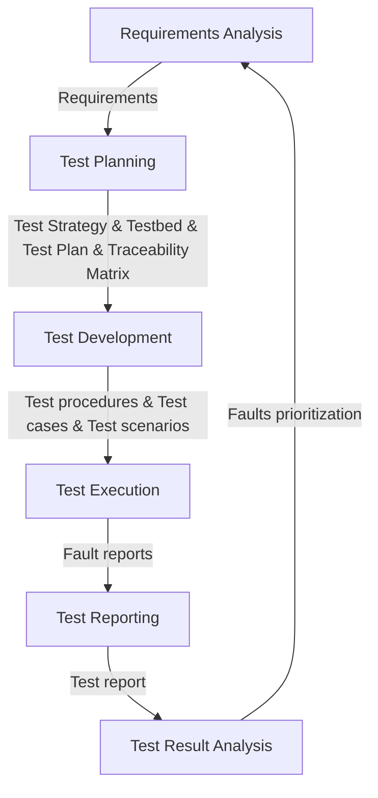

See also: [[thoughts/university/twenty-four-twenty-five/sfwr-3s03/ReviewsAndEvaluation.LNs.FULL.pdf|ReviewsAndEvaluation.LNs.FULL]], [[thoughts/university/twenty-four-twenty-five/sfwr-3s03/CoverageMetrics.LNs.FULL.pdf|CoverageMetrics.LNs.FULL]], [[thoughts/university/twenty-four-twenty-five/sfwr-3s03/TestingContext.LNs.FULL.pdf|TestingContext.LNs.FULL]] [[thoughts/university/twenty-four-twenty-five/sfwr-3s03/TestingClassification.LNs.FULL.pdf|TestingClassification.LNs.FULL]] [[thoughts/university/twenty-four-twenty-five/sfwr-3s03/UTandTDD.Additional.LNs.pdf|UTandTDD.Additional.LNs]]

## Evaluations Methods

## Testing Context

See also: [link](https://www.joelonsoftware.com/2002/05/06/five-worlds/)

Software can be:

- Shrinkwrap or COTS
- Internal
- Embedded
- Games
- Throwaway

> [!abstract] Defect
>
> Also known as the _flaw_ in the system

> [!abstract] Error
>
> Human mistake that introduces the said ==defect== in the system

> [!abstract] Failure
>
> Manifestation of the defect while _executing_ the system

| Aspect           | Exploratory Testing              | Specification-based Testing     | Model-based Testing                | Fuzz Testing                        | Partition Testing                                 | Boundary Testing                | Coverage-based Testing         |
| ---------------- | -------------------------------- | ------------------------------- | ---------------------------------- | ----------------------------------- | ------------------------------------------------- | ------------------------------- | ------------------------------ |
| Primary Goal     | Discover unexpected issues       | Verify requirements compliance  | Generate systematic tests          | Find security/stability issues      | Test equivalent input classes, or disjoint groups | Find edge case defects          | Ensure code path execution     |
| When to Use      | Early development, UI/UX testing | Formal systems, Safety-critical | Complex systems, Large test suites | Security testing, Robustness checks | Input validation, Data boundaries                 | Range limits, State transitions | Code completeness verification |
| Test Creation    | Ad-hoc, During execution         | Derived from specifications     | Generated from models              | Automated input generation          | Systematic division of inputs                     | Analysis of boundary conditions | Based on code structure        |
| Documentation    | Limited, Post-execution          | Extensive, Pre-planned          | Model documentation                | Automated reports                   | Input class definitions                           | Boundary condition specs        | Coverage reports & metrics     |
| Automation Level | Low                              | Medium to High                  | High                               | Very High                           | Medium                                            | Medium to High                  | Very High                      |
| Cost             | Low initial, High expertise      | High initial, Low running       | High initial, Low running          | Medium initial, Low running         | Low initial, Medium running                       | Medium initial, Medium running  | High initial, Low running      |
| Learning Curve   | Medium                           | High                            | High                               | Medium                              | Low                                               | Low                             | Medium to High                 |
|                  |                                  |                                 |                                    |                                     |                                                   |                                 |                                |

| Testing Approach            | Black Box | Grey Box | White Box | Notes                                                                            | Static | Dynamic | Notes                                                              | Functional | Non-Functional | Notes                                                             |
| --------------------------- | --------- | -------- | --------- | -------------------------------------------------------------------------------- | ------ | ------- | ------------------------------------------------------------------ | ---------- | -------------- | ----------------------------------------------------------------- |
| Exploratory Testing         | ✓         | ✓        | ✓         | Can be done at any level, but typically black/grey box                           |        | ✓       | Always requires running the system                                 | ✓          | ✓              | Can explore both functional behavior and qualities like usability |
| Specification-based Testing | ✓         |          |           | Based on external specifications, internal code knowledge not needed             | ✓      | ✓       | Can be both - static analysis of specs or dynamic execution        | ✓          | ✓              | Can test both functional and non-functional requirements          |
| Model-based Testing         | ✓         | ✓        |           | Usually black/grey box as based on system models                                 | ✓      | ✓       | Static model analysis and dynamic test execution                   | ✓          | ✓              | Models can represent both behavior and qualities                  |
| Fuzz Testing                | ✓         | ✓        |           | Typically done without code access, but can be enhanced with structure knowledge |        | ✓       | Requires actual execution with generated inputs                    |            | ✓              | Primarily tests robustness, security, stability                   |
| Partition Testing           | ✓         | ✓        |           | Can be done with or without code knowledge                                       | ✓      | ✓       | Can analyze partitions statically, but usually involves execution  | ✓          |                | Focuses on functional behavior through input space                |
| Boundary Testing            | ✓         | ✓        |           | Similar to partition testing, can be done at any level                           | ✓      | ✓       | Can identify boundaries statically, but usually involves execution | ✓          |                | Tests functional behavior at input boundaries                     |
| Coverage-based Testing      |           |          | ✓         | Requires access to source code to measure coverage                               |        | ✓       | Requires code execution to measure coverage                        | ✓          |                | Primarily about functional code execution                         |
| Fault Injection             |           | ✓        | ✓         | Usually requires code or binary access                                           |        | ✓       | Requires running the system to see effect of injected faults       |            | ✓              | Tests system resilience and error handling                        |

### QA Process

Waterfall versus. V-model versus. Agile

V-model: RA => syde => architecture => module design => coding => unit-testing => integration-testing => system testing => acceptance testing

iterative: RA => Analysis & Design => Testing => Evaluation => Planning

### Black-Box Testing

Black-box testing focuses on the functionality of the software without considering its internal structure or implementation.

### Grey-Box Testing

Grey-box testing combines elements of both black-box and white-box testing. It involves some knowledge of the internal structure but focuses on the functionality.

### White-Box Testing

White-box testing involves testing the internal structure or workings of an application, as opposed to its functionality.

### Fault Injection

- Deliberately introduces faults
- Tests system robustness
- Types:
  - Compile-time (source code changes)
  - Runtime (dynamic triggers)
  - Mutation testing (systematic code changes)

## Unit Testing and TDD

see also: https://martinfowler.com/bliki/UnitTest.html https://martinfowler.com/bliki/IntegrationTest.html

The whole purpose of TDD is to write a few test cases first, then update implementation to meet the minimal pass the tests, then incrementally add more tests to provide additional business logic to core functions.

### Unit Testing

- **Definition**: Unit tests focus on small parts of the software system, typically individual functions or classes.
- **Characteristics**:
  - Written by programmers using regular tools and a unit testing framework.
  - Expected to be fast, allowing frequent execution during development.
  - Can be solitary (isolation) or sociable (dependent on others).
- **Purpose**: To quickly identify issues in small, isolated parts of the codebase.
- **Frequency**: Run frequently, often after every code change, to catch defects early.

### Integration Testing

- **Definition**: Integration tests check if independently developed units of software work correctly when connected.
- **Characteristics**:
  - Can be broad (testing entire systems or subsystems) or narrow (testing specific interactions between units).
  - Narrow integration tests use test doubles to simulate dependencies, making them faster and easier to run.
  - Broad integration tests require live versions of all services, making them more complex and slower.
- **Purpose**: To ensure that different parts of the system work together as expected.
- **Frequency**: Narrow integration tests can run early in the development pipeline, providing quick feedback. Broad integration tests are often run less frequently due to their complexity.

## Coverage Metrics

Goal:

- find and _fix_ ==maximum== number of bugs
- Know if we have undiscovered bugs
- _Comply_ with standards
- Do testing with _minimum_ time and costs
-
- ![[thoughts/university/twenty-four-twenty-five/sfwr-3s03/measurements-coverage.webp|diagrams for testing flow]]

> [!important] Measurement
>
> mapping from empirical world to formal/ relational world, or also known as _symbol for a given entity_

> [!important] Software Metrics
>
> standards gives some attributes of interests

Coverage would be $\frac{\text{Executed Outcomes}}{\text{Total Outcomes}} \times 100$

- Branch
- Condition
- Condition/Decision
- Modified Condition/Decision

![[thoughts/university/twenty-four-twenty-five/sfwr-3s03/topology-metrics.webp]]

Path coverage would be $\frac{\text{Executed Unique Paths}}{\text{Total Unique Paths}}\times 100$

> [!note]
>
> Path coverage is **not the same** as exhaustive testing

Statement coverage would be $\frac{\text{Executed Statements}}{\text{Total Statements}} \times 100$

Branch coverage (each branch, or CFG edge) would be $\frac{\text{Executed Branches}}{\text{Total Branches}} \times 100$

Condition is the same but with evaluated to either `True{:python}` or `False{:python}`

Mutiple Condition Coverage (MCC) are the combinations of each decisions to either T/F

Modified Condition/Decision Coverage (MC/DC) are achieved either 100% branch cov, 100% condition coverage, and each condition _independently_ affect the decision outcome, each entry/exit point is executed

> for $n$ conditions, `MCC` requires $2^n$ test cases, whereas `MC/DC` only requires $n+1$ !!

> Tip: Build a truth table for [MC/DC](https://github.com/Armin-Montigny/MCDC)

> [!important]
>
> MC/DC is less expensive that MCC, but _still expensives_
>
> and Structural Coverage is **NOT** Structural testing

### Criteria Subsumption

_Criterion A subsumes criterion B if every test set that satisfies A **also** satisfies B_

### Control Flow Graph (CFG)

_think of state diagrams, same thing_

![[thoughts/university/twenty-four-twenty-five/sfwr-3s03/CFG-if-else.webp]]

![[thoughts/university/twenty-four-twenty-five/sfwr-3s03/CFG-while-branch.webp]]

![[thoughts/university/twenty-four-twenty-five/sfwr-3s03/technique|technique|Testing Techniques]]
