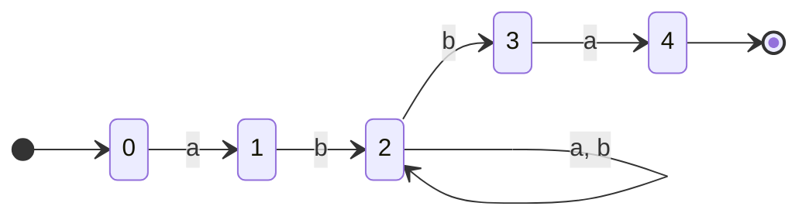
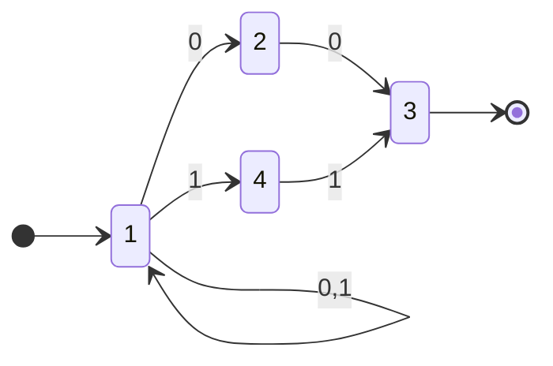
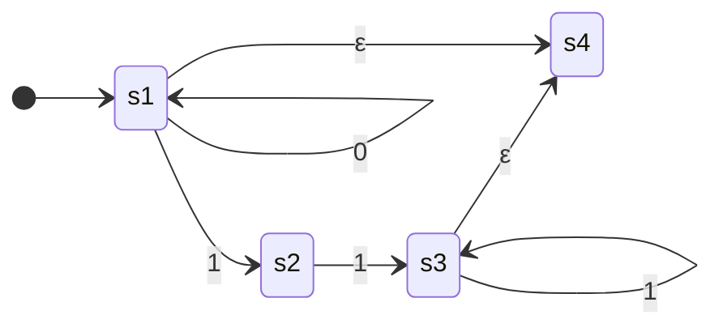

## definition

$$
\Sigma^{*}: \text{set of all strings based off }\Sigma
$$

$$
\begin{align*}
\text{NFA}\quad M &= (Q, \Sigma, \Delta, S, F)  \\\
Q &: \text{finite set of states} \\\
\Sigma &: \text{finite alphabet} \\\
\Delta &: Q \times \Sigma \rightarrow P(Q) \\\
S &: \text{Start states},\quad S \subseteq Q \\\
F &: \text{Final states},\quad F \subseteq Q \\\
\end{align*}
$$

## examples

1. $\mathcal{L}(M) = \{ abxba \mid x \in \Sigma^{*}\}$

2. $\mathcal{L}(M) = \{ yx \mid x = 00 \lor x =11 \land  y \in \Sigma^{*}\}$

## $\epsilon$ transition

![[thoughts/university/twenty-three-twenty-four/sfwr-2fa3/eps-nfa.jpeg]]

---

Given the following $M$

$\mathcal{L}(M) = \{0^n1^m \mid n \geq 0, m \neq 1 \space, x \in \Sigma^{*}\}$
