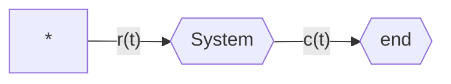
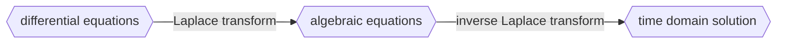

[[thoughts/university/twenty-three-twenty-four/sfwr-3dx4/intro.pdf|Introduction]] and [[thoughts/university/twenty-three-twenty-four/sfwr-3dx4/frequency_domain.pdf|Notes]]

Open-loop versus closed-loop

Transient and steady-state response

Stability

- Total response = Natural response + Forced response
  - Natural response (homogeneous solution): evolution of system due to initial conditions
  - Forced response (particular solution): evolution of system due to input

Control objects:
- Stabilize the system
- Produce the desired transient response
- Decrease/eliminate steady-state error
- Make system "robust" to withstand disturbances and variations in parameters
- Achieve optimal performance

## Block diagram representation of a system

_System as linear differential equation_

## Laplace Transform

$$\mathcal{L} \{f(t)\} = \int_0^{\infty}f(t)^{-st}dt = F(s)$$
$$
\begin{array}{c c c} \hline \text{Item no.} & f(t) & F(s) \\ \hline 1. & \delta(t) & 1 \\ 2. & u(t) & \frac{1}{s} \\ 3. & tu(t) & \frac{1}{s^2} \\ 4. & t^n u(t) & \frac{n!}{s^{n+1}} \\ 5. & e^{-at}u(t) & \frac{1}{s + a} \\ 6. & \sin(\omega t)u(t) & \frac{\omega}{s^2 + \omega^2} \\ 7. & \cos(\omega t)u(t) & \frac{s}{s^2 + \omega^2} \\ \hline \end{array}
$$
$$\delta{(t)} = 0, \quad t \neq 0,\quad \int_0^{\infty}{\delta{(t)}}dt=1$$

### Properties

$$
\begin{aligned}
& f(0-)\text{: initial condition just before 0}\\\
& \\\
& \textbf{Linearity:} \quad \mathcal{L}\{k_1 f_1(t) \pm k_2 f_2(t)\} = k_1 F_1(s) \pm k_2 F_2(s) \\\
& \\\
& \textbf{Differentiation:} \\\
& \quad \mathcal{L}\left\{\frac{df(t)}{dt}\right\} = sF(s) - f(0^-) \\\
& \quad \mathcal{L}\left\{\frac{d^2f(t)}{dt^2}\right\} = s^2 F(s) - sf(0^-) - f'(0^-) \\\
& \\\
& \textbf{Frequency Shifting:} \quad \mathcal{L}\{e^{-at}f(t)\} = F(s + a) \\\
\end{aligned}
$$

### Transfer function

$n^{th}$ order _linear, time-invariant_ (LTI) differential equation:
$$a_n \frac{d^n c(t)}{dt^n} + a_{n-1} \frac{d^{n-1} c(t)}{dt^{n-1}} + \cdots + a_0 c(t) = b_m \frac{d^m r(t)}{dt^m} + b_{m-1} \frac{d^{m-1} r(t)}{dt^{m-1}} + \cdots + b_0 r(t)
$$

_takes Laplace transform from both side_

$$
\begin{aligned}
& a_n s^n C(s) + a_{n-1} s^{n-1} C(s) + \cdots + a_0 C(s) \text{ and init terms for } c(t) \\\
& = b_m s^m R(s) + b_{m-1} s^{m-1} R(s) + \cdots + b_0 R(s) \text{ and init terms for } r(t) \\\
\end{aligned}
$$

_assume initial conditions are zero_

$$
\begin{aligned}
(a_n s^n + a_{n-1} s^{n-1} + \cdots + a_0)C(s) &= (b_m s^m + b_{m-1} s^{m-1} + \cdots + b_0)R(s) \\\
&\\\
\frac{C(s)}{R(s)} &= G(s) = \frac{b_m s^m + b_{m-1} s^{m-1} + \cdots + b_0}{a_n s^n + a_{n-1} s^{n-1} + \cdots + a_0} \\\
\end{aligned}
$$

> [!important] Transfer function
> $$
> G(s)=\frac{C(s)}{R(s)}
> $$

Q:  $G(s) = \frac{1}{S+2}$. Input: $u(t)$. What is $y(t)$ ?

$$
Y(s) = G(s)\cdot u(s) \rightarrow Y(s)=\frac{1}{s(s+2)} = \frac{A}{s} + \frac{B}{s+2} = \frac{1}{2\cdot{s}} - \frac{1}{2\cdot{(s+2)}}
$$
$$y(t) = -\frac{1}{2}(1-e^{-2t})u(t)$$

## Inverse Laplace transform

$$
\mathcal{L}^{-1} \{ F(s) \} = \frac{1}{2\pi j} \lim_{\omega \to \infty} \int_{\sigma-j\omega}^{\sigma+j\omega} F(s) e^{st} \, ds
$$

## Partial fraction expansion

$$
\begin{aligned}
F(s) &= \frac{N(s)}{D(s)} \\\
&\\\
N(s) &: m^{th} \text{ order polynomial in } s \\\
D(s) &: n^{th} \text{ order polynomial in } s \\\
\end{aligned}
$$
### Decomposition of $\frac{N(s)}{D(s)}$

1. **Divide if improper**: $\frac{N(s)}{D(s)}$ such that $\text{degree of }N(s) \leq \text{degree of } D(s)$ such that $\frac{N(s)}{D(s)} = \text{a polynomial } + \frac{N_1(s)}{D(s)}$
2. **Factor Denominator**: into factor form
	$$
	(ps+q)^m \text{ and } (as^2+bs+c)^n
	$$
3. **Linear Factors**: $(ps+q)^m$ such that:
	$$
	\sum_{j=1}^{m}\frac{A_j}{(ps+q)^j}
	$$
4. **Quadratic Factors**: $(as^2+bs+c)^n$ such that
	$$
	\sum_{j=1}^{n}{\frac{B_j s+C_j}{(as^2+bs+c)^j}}
	$$
5. **Determine Unknown**

## Stability analysis using Root of $D(s)$

> [!important] roots of $D(s)$
roots of $D(s)$ as **poles**

$$
G(s) = \frac{N(s)}{D(s)} = \frac{N(s)}{\prod_{j=1}^{n}(s+p_j)} = \sum_{j=1}^{n}{\frac{A_j}{s+p_j}}
$$
> $p_i$ can be imaginary

Solving for $g(t)$ gives
$$
g(t) = \sum_{j=1}^{n}{\mathcal{L}^{-1}\{\frac{A_j}{(s+p_j)}\}} = \sum_{j=1}^{n}{A_je^{-p_jt}}
$$

### stability analysis

> [!important]
> If $\sigma_i > 0$ then pole is in the left side of imaginary plane, and system is ==**stable** ==

### Complex root

For poles at $s=\sigma_i \pm j\omega$ we get

$$
\frac{\alpha + j\beta}{s + \sigma_i + j\omega_i} + \frac{\alpha - j\beta}{s + \sigma_i - j\omega_i}
$$

Wants to be on LHP for time-function associated with $s$ plane to be _stable_

## Impedance of Inductor

$$
Z(s) = \frac{V(s)}{I(s)} = Ls
$$
since the voltage-current relation for an inductor is $v(t) = L\frac{di(t)}{dt}$

## Impedance of Capacitor

$$
Z(s) = \frac{V(s)}{I(s)} = \frac{1}{Cs}
$$
since the voltage-current relation for a capacitor is $v(t) = \frac{1}{C} \int_0^{t}{i(\tau) d\tau}$
